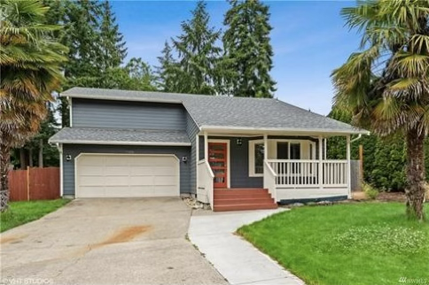
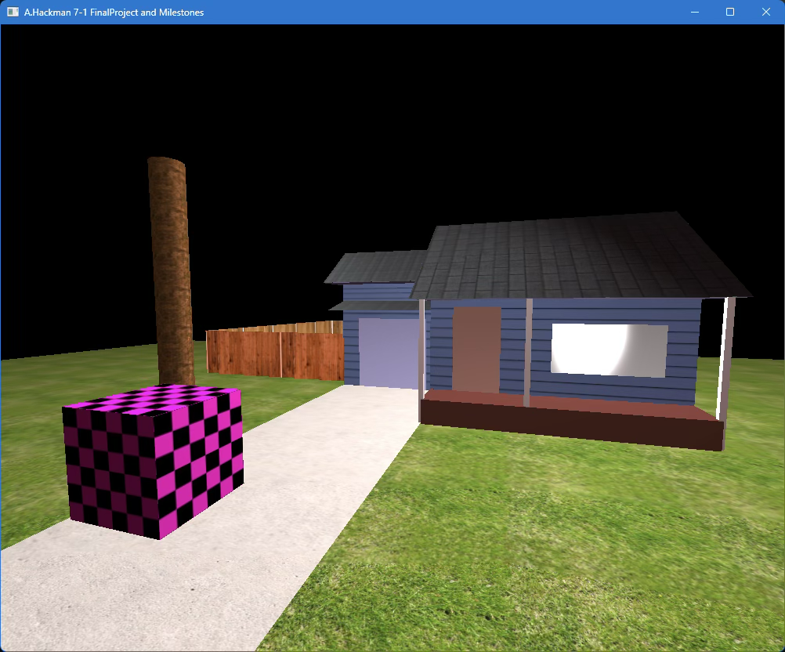
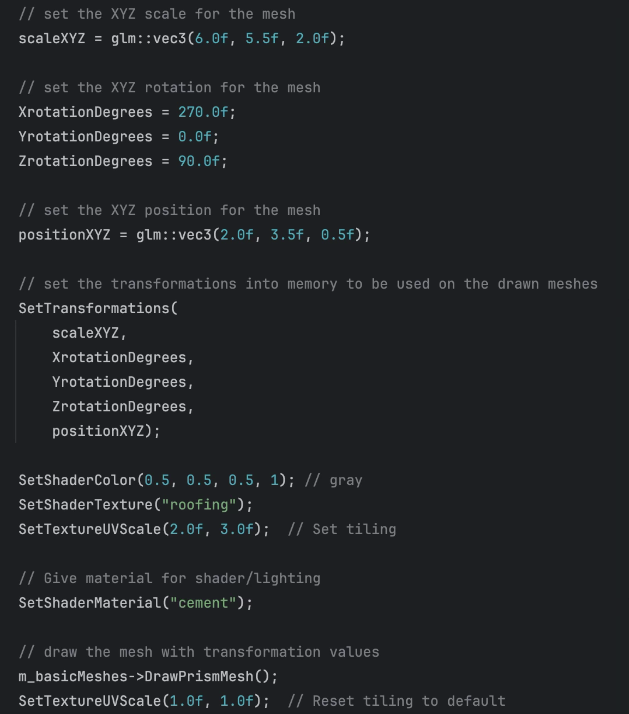

# CS330-CompGraphicVisualization

## OpenGL, C++

### Portfolio item from Fall 2025 CS330 Comp. Graphic and Visualization. This project is a rendered 3D Scene, built with OpenGL, and utilizing C++

For this project I had chosen to try and recreate my house, this sounded like a fun subject to recreate using basic 3D shapes.
This decision seemed to be within my scope of skills so I wanted to attempt it.
My chosen subject made the requirements more complicated as we needed four basic shapes.
I have made the roof from two prisms on their side, one for the inner roof (ceiling), and one for the shingles.
Multiple boxes for the house, porch, supports etc. Six planes were created to make the ground, driveway, fencing, doors, and window.
One cylinder was used for the base of a tree, needing foliage.
The choice of prism for the roof made the garage roofing portion more complex, in hindsight using an inner roof was a great idea,
however to avoid the overlap I would have chosen a plane now for the outer roof.
I also would have liked to make the garage a bit wider when comparing. The changes would allow me to make the design closer to the reference as shown below.

Reference Image:

Project Sample:

Implementing the textures was more straightforward as we are wrapping the mesh of the shape with a texture sourced from a royalty free site. Shaders were also not too difficult to understand, we define the objects material for the light to interact with. We can change the hue, or specular intensity of the reflection from the object when lit. Lighting haunted me for a couple days as I overcomplicated the addition, getting strange spotlight like lighting and nothing else. I had forgot to add ambient and diffuse resulting in just the highlights of the objects to be visible. I was accidentally building the lighting in reverse!

Implementing controls has been accomplished using the view manager header, and view manager source; within the `ProcessKeyboardEvents` function, we send an input to the queue to be rendered. This is then processed and displayed with the changes to the camera position, or direction (depending on the input) allowing navigation of the 3D scene. To navigate around the scene:

- WASD - moves the camera forward, backward, left, and right
- QE - moves the camera upward and downward
- P - Toggles the camera view between Orthographic and Perspective view
- Esc - Closes the window
- Mouse - changes the orientation of the camera to look up, down, left and right
- Scroll Wheel - adjusts the movement speed of the camera

Other than the shapes created, I had not set up any custom functions within the code. Following the resources throughout the course has set up a basic manageable 3D environment utilizing PHONG lighting in OpenGL. The source directory was set up a modular structure already and I wanted to learn as much as I could within the limited amount of time. Initially, I wanted to make the scene first exist, next I would then start making this even more modular. Most of the reused blocks followed the format pictured below.

Code Sample:

For a still 3D project such as this one, I would store the variables of the objects within the scene to a table, or a JSON. I would then load the table when drawing the scene to take a lot of the lines out of the scene manager. Scene manager does a lot of the heavy lifting here, so taking some of the computing off of that would be ideal when I think of efficiency. This could then also allow for more than one scene to be accessed, making this more into an experience. After this, a loading screen could be implemented when loading a new scene.
